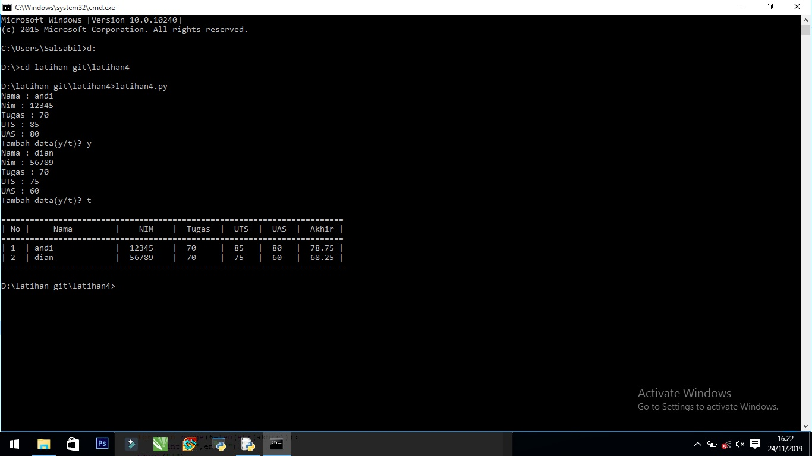
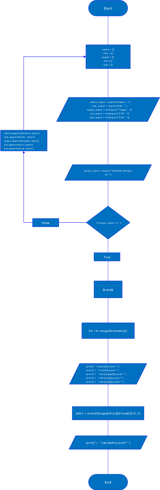

Penjelasan Program 4

1.Pertama buat program akan mendeklarasikan beberapa list kosong.

2.Kemudian anda akan dimintai menginput untuk menambah list yang kosong yang dibuat tadi.

3.Anda diminta menginputkan beberapa data.

4.Anda akan dimintai input "Tambah data (y/t)?", dengan menggunakan perintah while, jika anda menekan huruf t makan perintah while akan berhenti "break" dan akan lanjut ke perintah berikutnya, 
  jika anda menekan y maka program akan mengeksekusi input yang anda masukan untuk dimasukan ke dalam List kosong tersebut menggunakan perintah "append", sesuai dengan variabel List yang terhubung dengan perintah input pada masing masing data tersebut, lalu program akan mengulang ke input.

5.Dengan menggunakan for, program akan melakukan perulangan dan membuat baris berdasarkan berapa banyak input di "list nama" >>for i in range(len(nama)): .

6.Nilai i akan ditambah 1, dengan menghitung berapa banyak jumlah list di variabel "nama", jika anda menginputkan tiga buah nama, maka penambahan nilai i akan di ulang sebanyak tiga kali, sehingga menghasilkan deret angka 1,2,3 >>print("|",i+1,end="").

7.Selanjutnya program akan menampilkan semua nilai yang telah anda inputkan.

Program akan memanggil data nama,nim,tugas,uts,uas.
Lalu program akan meletakan data tersebut pada baris berdasarkan variabel "i", jika anda menginputkan 4 buah nama maka akan tampil.
1. nama1 nim1 tugas1 uts1 uas1
2. nama2 nim2 tugas1 uts2 uas2.
3. nama3 nim3 tugas1 uts3 uas3
4. nama4 nim4 tugas1 uts4 uas4

8.Untuk menampilkan nilai Akhir, program akan mengambil nilai rata rata dari nilai tugas,uts,uas dengan cara menambahkan data-data sesuai dengan index dari variabel "i".

tugas1*0.3+uts1*0.35+uas1*0.35
tugas2*0.3+uts2*0.35+uas2*0.35		
tugas3*0.3+uts3*0.35+uas3*0.35
tugas4*0.3+uts4*0.35+uas4*0.35

9.Lalu Program akan mengoutputkan semua data yang telah di olah.

10.Program selesai.

